# HISTORICAL WALK-FORWARD V2

## Direct answers

- Positive gross/net executable alpha: **ZERO POINT ESTIMATE / INSUFFICIENT EVIDENCE**
- PM lag after causal external signal: **UNKNOWN / INSUFFICIENT EVIDENCE**
- Prior zero-trade diagnosis: **see PM executable-edge distribution and funnel below.**
- Principal bottleneck: **SEE_FUNNEL_AND_FRICTION_DECOMPOSITION**

## Identity

- Starting SHA: 92167499de26a9f7daf7891c8a0a284af7064a76
- Data SHA: a6f5806690c74fd77442f8943b1644d053475bcaf040a83e310b0ab064c22649
- Input state: READY
- Decisions: 280669
- Markets: 1552
- Short-horizon pairs: 146473
- OOS predictions: 194968

## Selected combined-policy economics

- Simulated orders: 0
- Fills: 0
- Settled fills: 0
- Net/observed PnL: 0
- Fill rate: None

The report never converts unavailable books, labels, forecasts, or fills into zero.

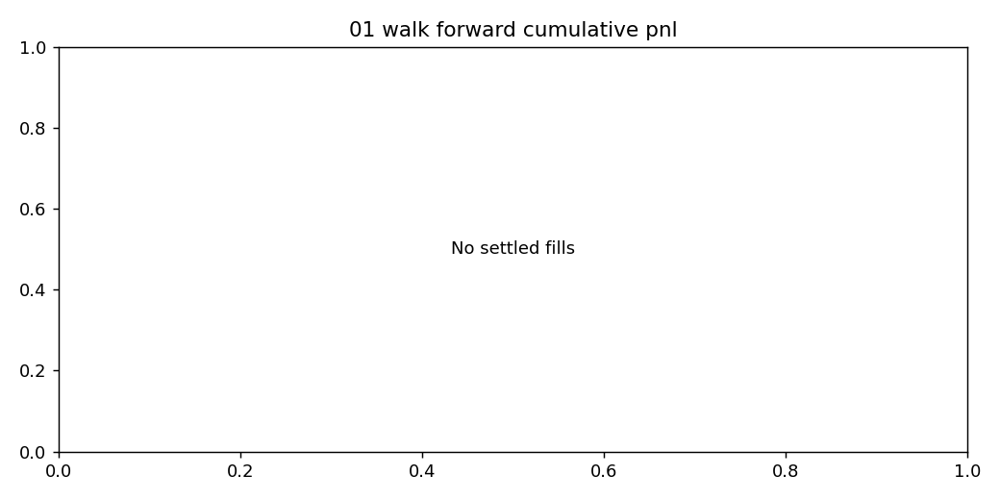

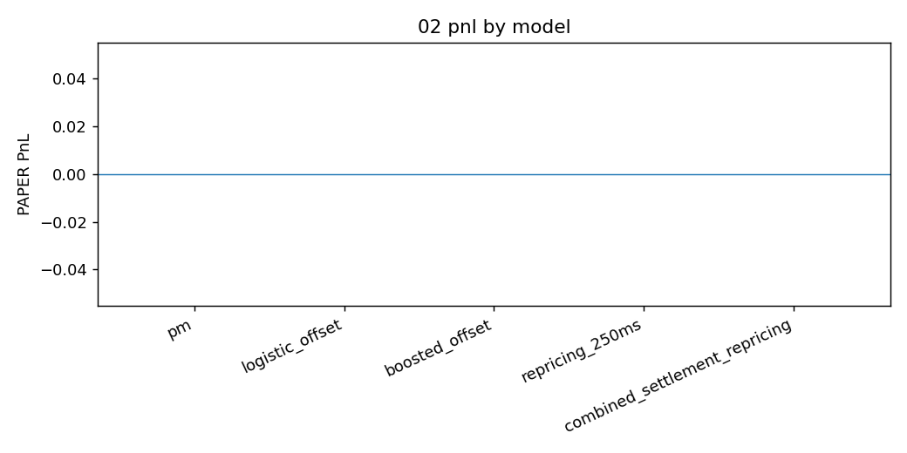

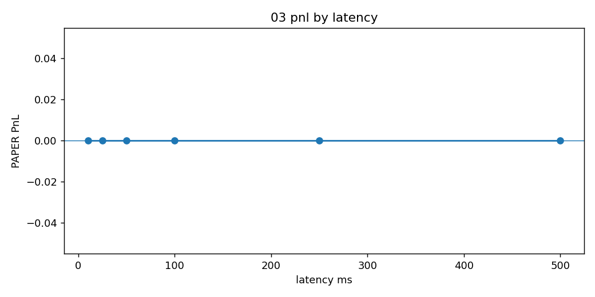

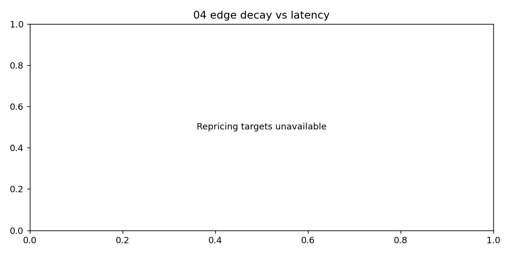

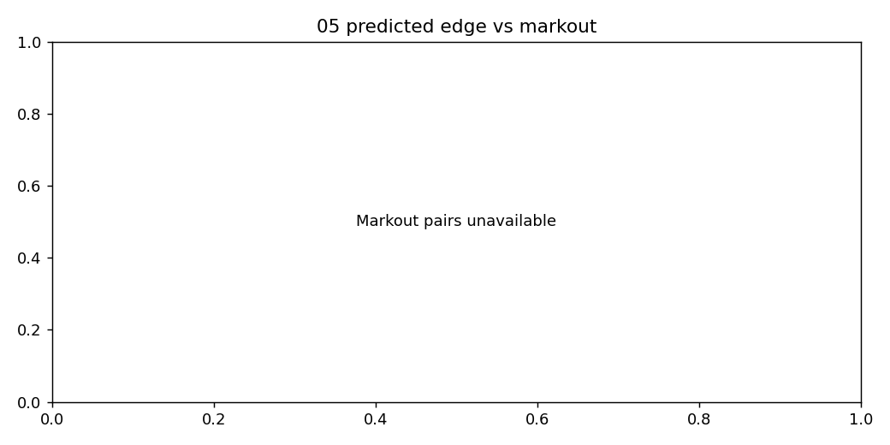

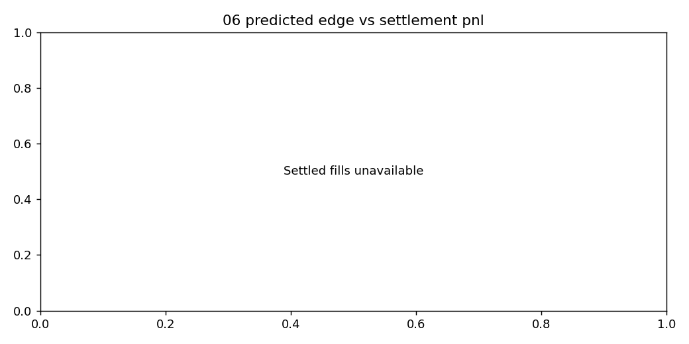

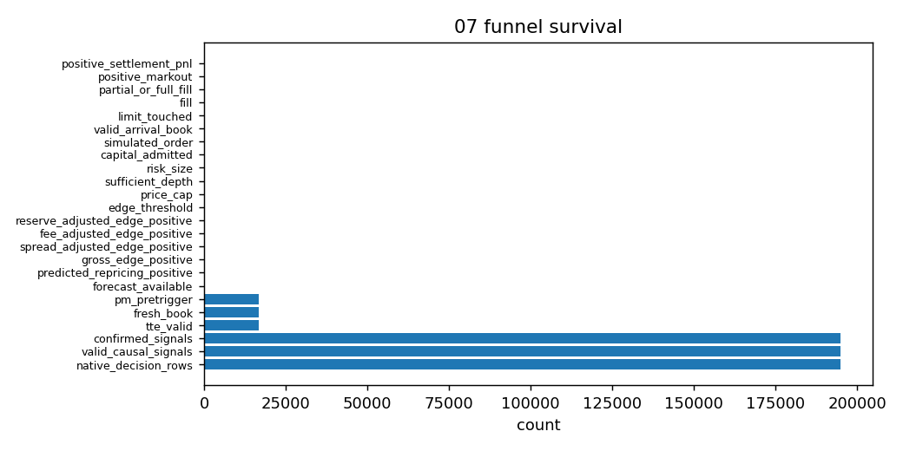

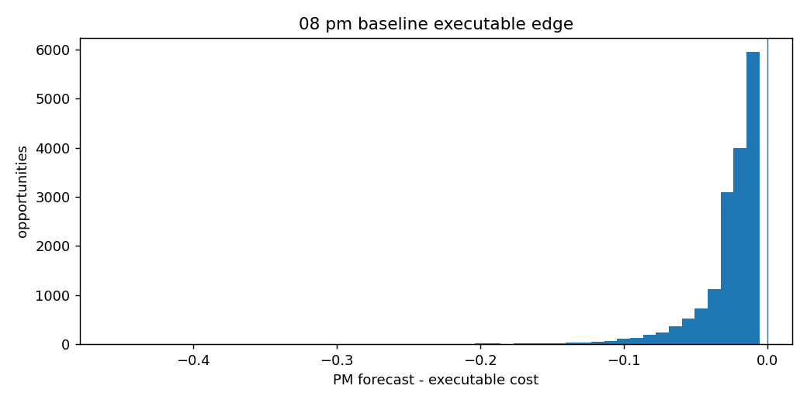

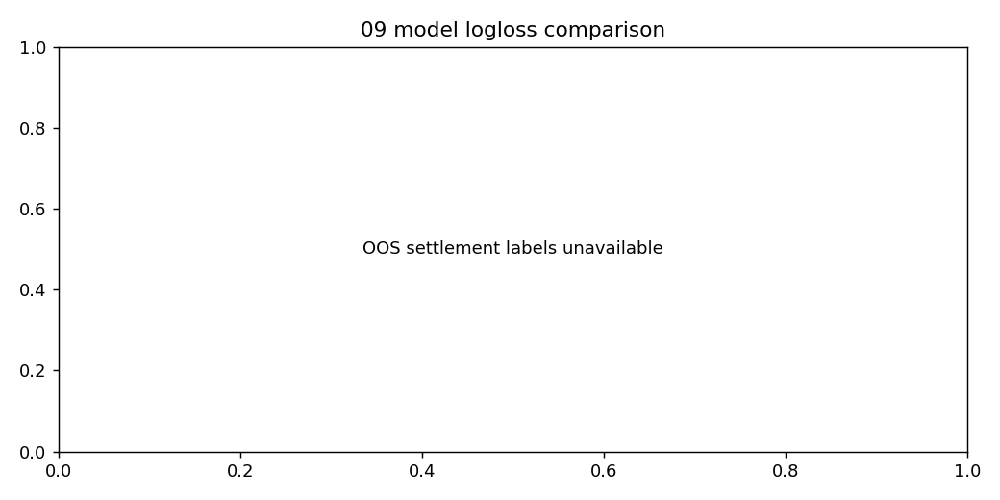

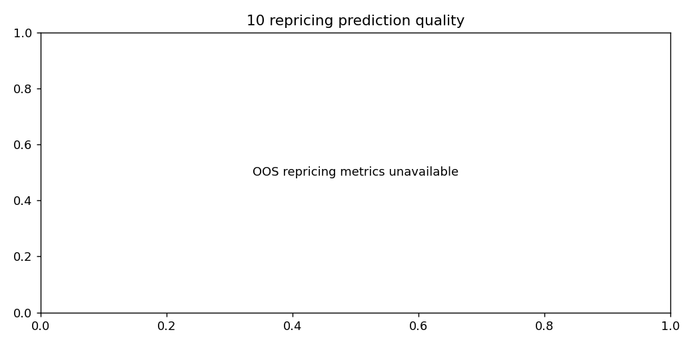

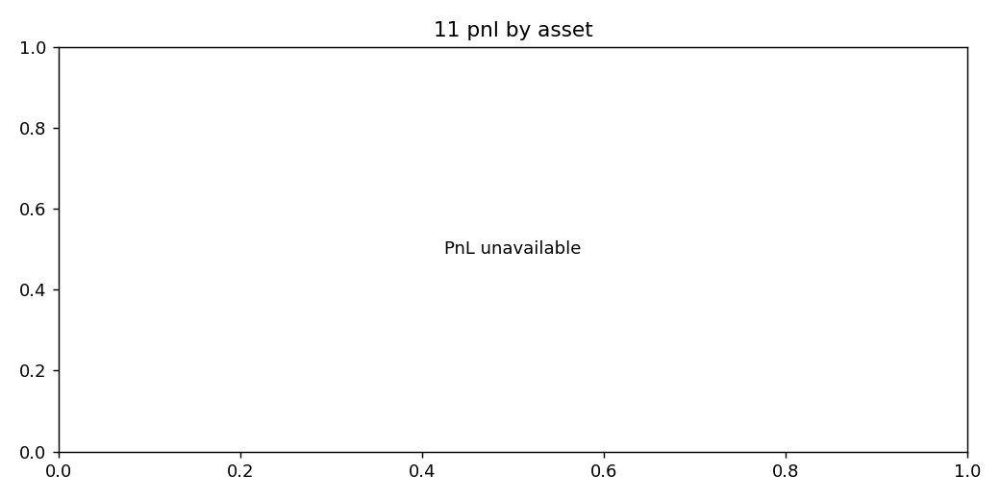

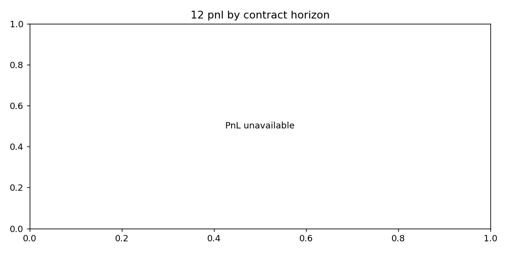

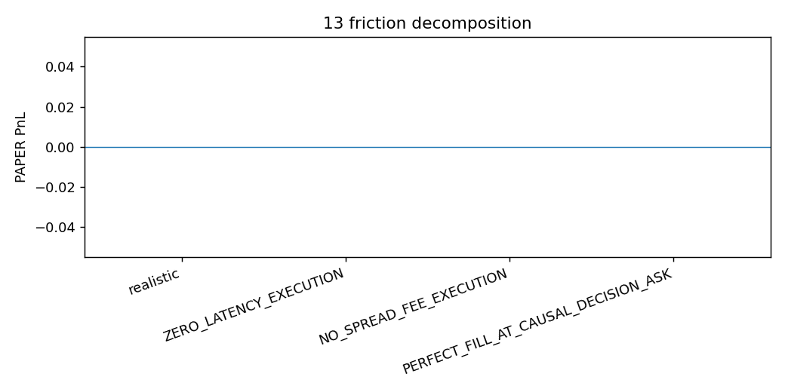

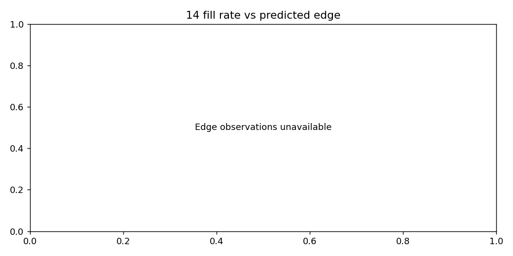
