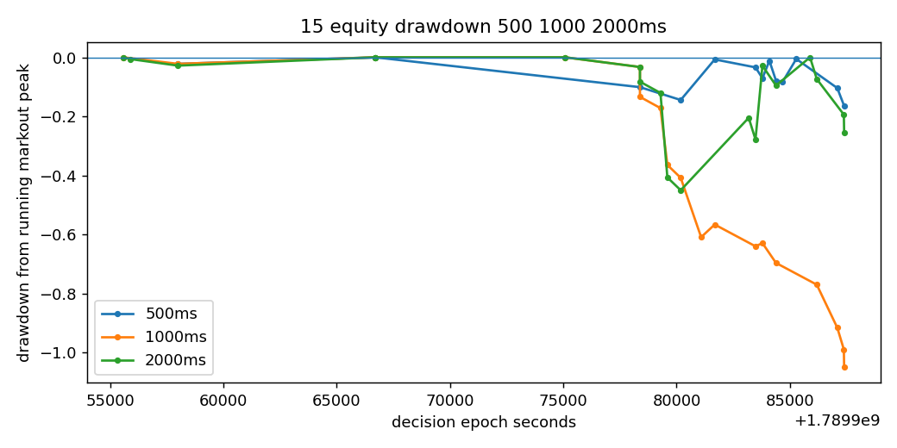

# HISTORICAL WALK-FORWARD V2

## Direct answers

- 500ms-reference OOS executable markout: **POSITIVE POINT ESTIMATE / UNCERTAIN**
- Settlement alpha: **UNKNOWN / INSUFFICIENT CAUSAL SETTLEMENT LABELS**
- PM lag after causal external signal: **POSITIVE DESCRIPTIVE 250MS MOVE**
- Prior zero-trade diagnosis: **PM midpoint baseline cannot cross executable ask plus costs.**
- Principal bottleneck: **SEE_FUNNEL_AND_FRICTION_DECOMPOSITION**

## Identity

- Starting SHA: 4c2ca2d522b19d88dd078052ec6626e4005d675c
- Data SHA: cd31656854adf5fbd885676ca32bf12ba3d7a33a6b9292a4058bf5a12818be71
- Input state: READY
- Decisions: 392053
- Markets: 1904
- Short-horizon pairs: 76373
- OOS predictions: 296279
- Full-window midpoint models ready: 7
- Full-window executable-markout models ready: 7

## 500ms reference executable-markout economics

- Simulated orders: 43
- Fills: 19
- Marked fills: 13
- Positive marked fills: 4
- Net executable markout: 0.08344899999999936
- Markout/fill: 0.006419153846153797
- Fill rate: 0.4418604651162791

The report never converts unavailable books, labels, forecasts, or fills into zero.

