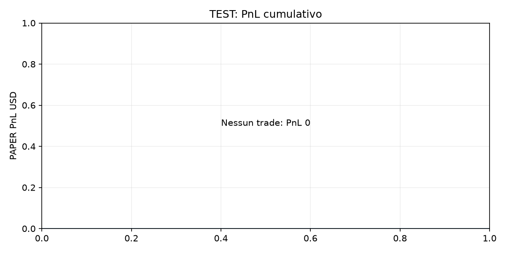
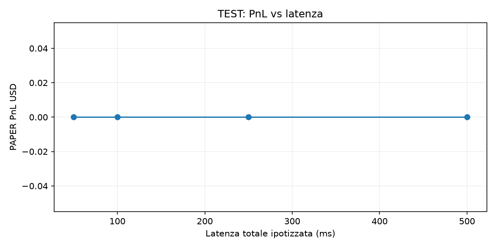
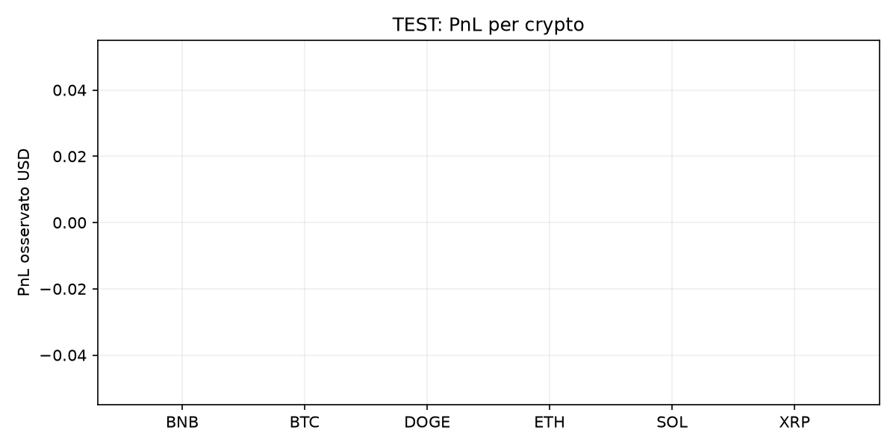
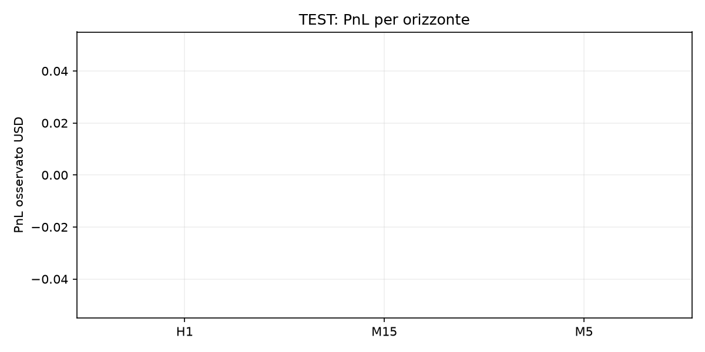
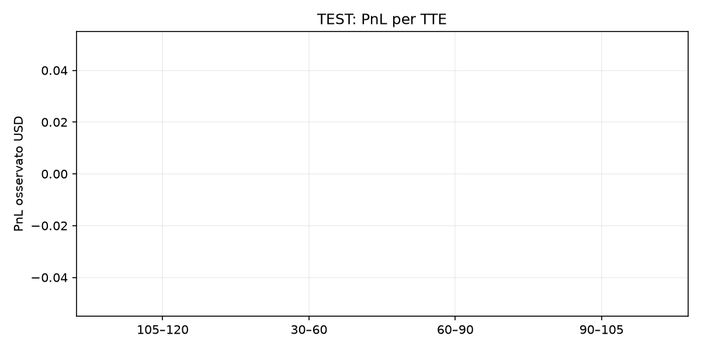
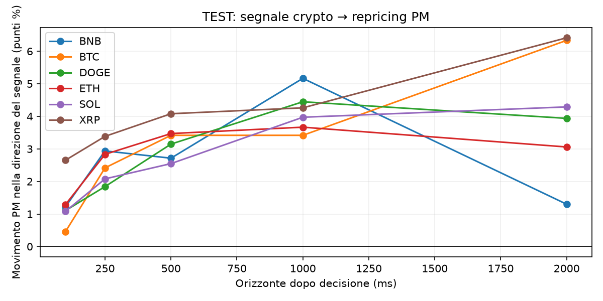
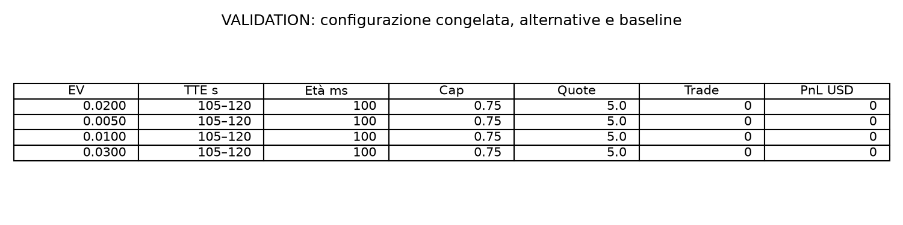

# Backtest PAPER: dati recenti

Intervallo UTC: 2026-09-20T16:30:00+00:00 — 2026-09-20T18:29:11.671000+00:00.

**FINAL HISTORICAL TEST RESULT**

Replay separato dal fit e dall’attivazione. `paper_only=true`, `authenticated_execution=false`, `real_order_submission=false`.

Stato selezione: `INSUFFICIENT_VALIDATION_SUPPORT_BASELINE_FROZEN`. Una baseline congelata per insufficienza di dati non è una configurazione vincente.

Modello: Existing pm; first fit on today old-history partition; frozen before TEST. SHA: f8c1a32255e1d5919d3fcd1e41afd1eca6d53970df84fe7fc4ce8faece09e169.

Parametri congelati: EV 0.02, TTE 105–120 s, età massima 100 ms, cap 0.75, 5.0 quote.

## VALIDATION RESULT

31 configurazioni prespecificate; trade 0, fill 0, PnL 0. Minimo 5 mercati con fill e copertura contabile completa per selezionare.

| EV | TTE s | Età ms | Cap | Quote | Trade | PnL USD |
|---|---|---|---|---|---|---|
| 0.0200 | 105–120 | 100 | 0.75 | 5.0 | 0 | 0 |
| 0.0050 | 105–120 | 100 | 0.75 | 5.0 | 0 | 0 |
| 0.0100 | 105–120 | 100 | 0.75 | 5.0 | 0 | 0 |
| 0.0300 | 105–120 | 100 | 0.75 | 5.0 | 0 | 0 |

Primo fit autorizzato: 9441 righe, 78 mercati; confronto su 2643 righe e 42 mercati successivi. Famiglie: pm, logistic_offset, boosted_offset. Selezione modello per log loss di validazione; nessun uso del TEST.

Disponibilità storica delle label: Public closedTime/umaEndDate; fetched later. Not archived availability proof. Questo primo fit è retrospettivo e non è idoneo alla promozione. La raccolta giornaliera usa invece l’effettivo istante di ricezione delle risoluzioni.

## FINAL HISTORICAL TEST RESULT

Opportunità 3790; senza previsione 0; trade 0; fill 0; fill rate N/D; PnL 0; PnL/trade N/D; fee 0; turnover 0; drawdown N/D.

Le previsioni sono disponibili. Nessun trade significa nessuna esposizione e nessuna evidenza di redditività.

| Latenza totale ms | Trade | Fill | PnL USD | Deterioramento medio |
|---|---|---|---|---|
| 50 | 0 | 0 | 0 | N/D |
| 100 | 0 | 0 | 0 | N/D |
| 250 | 0 | 0 | 0 | N/D |
| 500 | 0 | 0 | 0 | N/D |

Latenze prespecificate, nessuna scelta sulla base del TEST. La latenza London reale non è stata misurata. Libro osservato DOPO la latenza, tolleranza massima 50 ms aggiuntivi; solo quantità L1 visibile; fill parziali; fee storiche. Nessun prezzo precedente riutilizzato. Un tentativo per mercato, cap 3,75 USD e 20 quote; riserva complessiva 1.000 USD senza riciclo.

## Lead-lag diagnostico

| Crypto | Orizzonte ms | Campioni | Mercati | Movimento PM direzionale |
|---|---|---|---|---|
| BNB | 100 | 9 | 4 | 0.0122 |
| BNB | 250 | 8 | 3 | 0.0294 |
| BNB | 500 | 7 | 4 | 0.0271 |
| BNB | 1000 | 6 | 4 | 0.0517 |
| BNB | 2000 | 5 | 2 | 0.0130 |
| BTC | 100 | 6 | 3 | 0.0046 |
| BTC | 250 | 6 | 3 | 0.0242 |
| BTC | 500 | 6 | 3 | 0.0342 |
| BTC | 1000 | 6 | 3 | 0.0342 |
| BTC | 2000 | 3 | 2 | 0.0633 |
| DOGE | 100 | 24 | 8 | 0.0110 |
| DOGE | 250 | 19 | 6 | 0.0184 |
| DOGE | 500 | 17 | 5 | 0.0315 |
| DOGE | 1000 | 19 | 6 | 0.0445 |
| DOGE | 2000 | 16 | 6 | 0.0394 |
| ETH | 100 | 19 | 6 | 0.0129 |
| ETH | 250 | 18 | 6 | 0.0283 |
| ETH | 500 | 17 | 6 | 0.0347 |
| ETH | 1000 | 18 | 6 | 0.0367 |
| ETH | 2000 | 17 | 6 | 0.0306 |
| SOL | 100 | 25 | 8 | 0.0108 |
| SOL | 250 | 19 | 8 | 0.0208 |
| SOL | 500 | 21 | 8 | 0.0255 |
| SOL | 1000 | 18 | 8 | 0.0397 |
| SOL | 2000 | 19 | 7 | 0.0429 |
| XRP | 100 | 23 | 5 | 0.0265 |
| XRP | 250 | 26 | 5 | 0.0338 |
| XRP | 500 | 25 | 5 | 0.0408 |
| XRP | 1000 | 23 | 5 | 0.0426 |
| XRP | 2000 | 23 | 6 | 0.0641 |

Media condizionata alla copertura disponibile, non un rendimento negoziabile. Segnali nativi validi e confermati; un segnale per mercato/secondo. I token DOWN sono già orientati nella direzione prevista. L’orizzonte è dalla decisione, non dal timestamp dell’exchange esterno.

## Risposte economiche

1. Profitto storico: non dimostrato; nessun trade nella configurazione congelata.
2. TEST intatto: PnL 0, senza esposizione; parametri invariati dopo la validazione.
3. Trade/fill: 0/0.
4. Concentrazione: non applicabile, nessun profitto.
5. Crypto migliore: nessuna; BTC, ETH, SOL, XRP, DOGE e BNB hanno PnL 0.
6. Orizzonte migliore: non identificato.
7. TTE migliore: non identificato; 105–120 s resta il baseline.
8. Età segnale migliore: non identificata; baseline 100 ms.
9. EV minimo migliore: non identificato; baseline 0,02.
10. Sensibilità alla latenza: non identificabile senza trade; PnL 0 a 50/100/250/500 ms.
11. Latenza di scomparsa dell’edge: non stimabile.
12. Lead-lag: le medie condizionate nella tabella sono un indizio descrittivo, con pochi mercati e copertura selettiva; non dimostrano un edge negoziabile.
13. Forward PAPER: utile continuare a raccogliere dati e verificare i candidati; questo test non giustifica affermare che il sistema sia redditizio.

## Grafici

